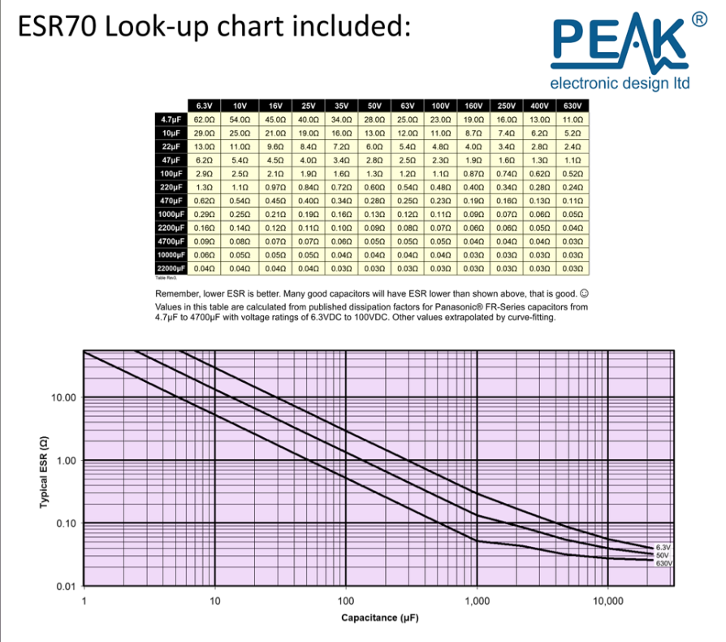

# capacitor-critical-esr-calculator

## Background

Equivalent series resistance (ESR) is a property of a capacitor that can help determine whether it is functioning properly or not.
When new, a capacitor's ESR is normally quite low and will, in time and with use, begin to increase.
When the ESR increases beyond some critical value, it will cease to function properly in-circuit even though its measured capacitance may still be within spec.

A somewhat specialized device is required to measure ESR, such as Peak Electronics' [Atlas ESR Gold](https://www.peakelec.co.uk/acatalog/esr70-capacitor-esr-meter.html).

To assess proper functioning, measure the capacitor's ESR and compare to the threshold ESR value.  
Peak Electronics provides threshold ESR for discrete values of capacitance and voltage:

If the measured value is less than the threshold value, it is properly functioning; if it is greater, the capacitor is likely faulty.

In general, **LOWER ESR IS BETTER**.

## Present work

The aim is to determine threshold ESR for arbitary values of capacitance and voltage.
Peak's data at discrete values is used as a baseline.
SciPy's implementation of two-dimensional interpolation *interp2s* is used to compute threshold ESR at intermediate values.
Since interpolation is employed here, this tool should not be used much beyond the bounds over which critical ESR is computed (10 - 630V, 4.7 - 22000 $\mu$F).

## Future work

* Read capacitance, voltage, ESR values from file rather than hard coding

